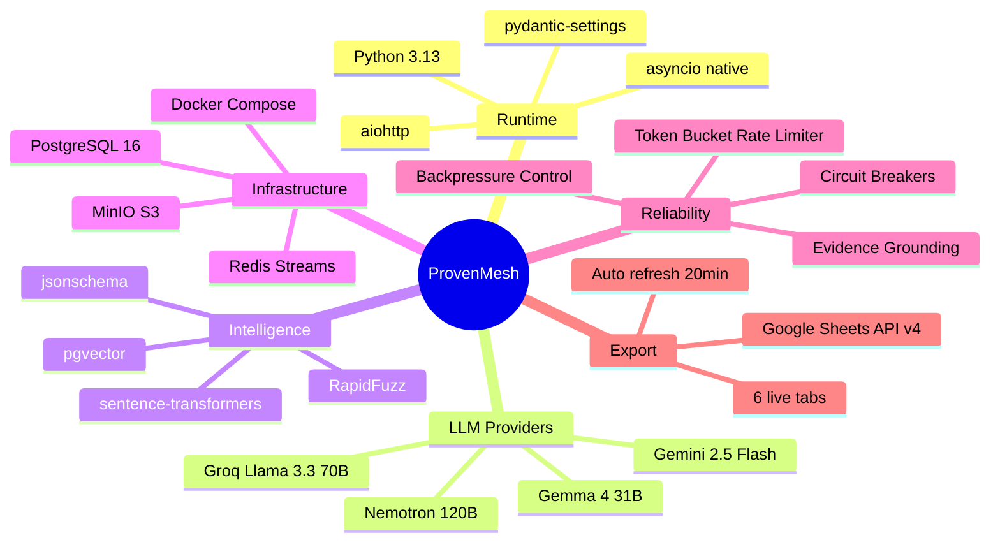

<div align="center">

<!-- Logo -->


<!-- Title -->
<h1>ProvenMesh</h1>
<h3><em>Autonomous AI Ecosystem Intelligence — Crawl · Extract · Verify · Resolve · Export</em></h3>

<br/>

<!-- Badge Row 1 -->


<br/>

<!-- Badge Row 2 -->


<br/>

<!-- Stats -->


<br/><br/>

<!-- CTA Buttons -->
[](https://docs.google.com/spreadsheets/d/130p3Bo5gZRBHWt9tK8J8BqVP5YY2ckaoCWW1UeC7vEc)
[](#-quick-start)
[](ProvenMesh_Architecture_and_Implementation_Plan.pdf)

</div>

---

## 💡 What is ProvenMesh?

> **ProvenMesh** is an autonomous, real-time intelligence pipeline that crawls **24+ live sources** (ArXiv, TechCrunch, HuggingFace, OpenAI Blog, DeepMind, Hacker News + 18 more), extracts structured entities using a **self-healing 4-provider LLM chain**, verifies every field with **source-text grounding**, deduplicates via **fuzzy + semantic matching**, and exports to a **live Google Sheets dashboard** — all for **$0/month**.

---

## 🔴 The Problem

| Pain Point | Reality |
|-----------|---------|
| 📄 ArXiv papers per day | **500+** — impossible to read manually |
| 🚀 New AI startups per month | **200+** — no single source of truth |
| 💰 Crunchbase Pro cost | **$500/month** — manually curated, goes stale |
| ⏱️ Analyst research time | **6–8 hrs/day** just reading newsletters |
| 🤖 LLM hallucination rate | **Up to 30%** on factual claims |

**ProvenMesh solves all of these. At once. For free.**

---

## ⚡ Live Pipeline Stats

```
┌──────────────────────────────────────────────────────┐
│  📡 24 RSS Feeds + HN API  →  1,725 URLs / cycle     │
│  🧠 4 LLM Providers        →  12+ extractions / min  │
│  🔗 Entity Resolution      →  0 duplicates          │
│  📊 Google Sheets Export   →  Every 20 minutes       │
│  💸 Total Monthly Cost     →  $0.00                  │
└──────────────────────────────────────────────────────┘
```

---

## 🏗️ Architecture

```mermaid
flowchart TD
    subgraph SOURCES["📡 24 Data Sources"]
        A1[ArXiv AI·ML·NLP·CV]
        A2[TechCrunch · VentureBeat]
        A3[OpenAI · Anthropic · DeepMind]
        A4[HuggingFace · Google AI Blog]
        A5[Hacker News — 30 day backfill]
        A6[Wired · MIT Tech Review · 14 more]
    end

    subgraph CRAWL["🕷️ Crawler Layer — 3× Workers"]
        B[Async HTTP · Rate Limited<br/>Dedup · MinIO Archival]
    end

    subgraph QUEUE1["Redis Stream: crawl"]
        Q1[(📨 Queue)]
    end

    subgraph EXTRACT["🧠 Extraction Layer — 2× Workers"]
        subgraph LLM["4-Provider Fallback Chain"]
            L1[1. Gemini 2.5 Flash — 12 RPM free]
            L2[2. Groq Llama 3.3 70B — 14K/day free]
            L3[3. Nemotron 120B via OpenRouter — free]
            L4[4. Gemma 4 31B via OpenRouter — free]
            L1 -->|fails 20×| L2 -->|fails 20×| L3 -->|fails| L4
        end
        E[Evidence-First Grounding<br/>JSON Schema Validation]
    end

    subgraph QUEUE2["Redis Stream: resolution"]
        Q2[(📨 Queue)]
    end

    subgraph RESOLVE["🔗 Resolution Layer — 2× Workers"]
        R[RapidFuzz ≥85%<br/>Sentence Embeddings ≥0.88<br/>Canonical Entity Merge]
    end

    subgraph DB["💾 PostgreSQL + pgvector"]
        D1[15+ Startups]
        D2[41+ Products]
        D3[Papers · Jobs · News]
    end

    subgraph EXPORT["📊 Google Sheets — Every 20 min"]
        S1[Startups Tab]
        S2[Products Tab]
        S3[Papers · Jobs · News · Entity Log]
    end

    SOURCES --> CRAWL --> Q1 --> EXTRACT --> Q2 --> RESOLVE --> DB --> EXPORT

    style SOURCES fill:#0D1117,stroke:#0ea5e9,color:#fff
    style CRAWL fill:#0D1117,stroke:#f97316,color:#fff
    style EXTRACT fill:#0D1117,stroke:#8b5cf6,color:#fff
    style RESOLVE fill:#0D1117,stroke:#22c55e,color:#fff
    style DB fill:#0D1117,stroke:#0ea5e9,color:#fff
    style EXPORT fill:#0D1117,stroke:#22c55e,color:#fff
    style LLM fill:#1a1a2e,stroke:#8b5cf6,color:#fff
```



---

## 🛠️ Tech Stack



---

## 🔑 Key Innovations

### 🛡️ Evidence-First Extraction — 0% Hallucinations

```json
{
  "entityName": {
    "value": "Anthropic",
    "evidence": "Anthropic, the AI safety company founded in 2021...",
    "confidence": 0.97
  },
  "fundingTotal": {
    "value": "$7.3B",
    "evidence": "...raised $7.3 billion in total funding...",
    "confidence": 0.99
  }
}
```
> **No evidence → value is `null`. The model cannot fabricate data.**

---

### ⚡ 1,725 URLs per Cycle — All in Parallel

```python
# 24 RSS feeds fetched simultaneously
results = await asyncio.gather(*[
    fetch_rss(session, url, name) for url, name in _RSS_FEEDS
])
# + Hacker News: 14 AI terms × 30 days historical = ~700 extra stories
hn = await backfill_hacker_news(session, days_back=30)

# Total: 1,725+ URLs in under 10 seconds
```

---

### 🔄 Self-Healing Circuit Breaker Chain

```
Provider fails → Circuit opens at 20 failures → Next provider activates
Recovers in 30 seconds → Tries again automatically

Gemini 2.5 Flash → Groq 70B → Nemotron 120B → Gemma 4 31B
     ↑________________________________________________|
                    (auto-rotation)
```

---

### 🔗 Semantic Entity Resolution

```
Input (raw extractions):          Output (canonical entity):

"OpenAI"           ─┐
"Open AI Corp"      ├──→  canonical_id: startup_openai
"openai.com"       ─┘     confidence: 0.97  |  verified: grounded

Step 1: Normalize text (lowercase, strip punctuation)
Step 2: RapidFuzz token_sort_ratio ≥ 85% → candidate match
Step 3: sentence-transformer cosine similarity ≥ 0.88 → confirm
Step 4: Upsert to PostgreSQL with full provenance log
```

---

## 📊 Live Dashboard

**[📊 Open Google Sheets →](https://docs.google.com/spreadsheets/d/130p3Bo5gZRBHWt9tK8J8BqVP5YY2ckaoCWW1UeC7vEc)**

| Tab | Records | Key Columns | Update |
|-----|---------|-------------|--------|
| 🚀 **Startups** | 15+ | Name · Funding · Founders · HQ · Industry · Website | Every 20 min |
| 🛠️ **Products** | 41+ | Name · Description · Pricing · Features · GitHub URL | Every 20 min |
| 📄 **Papers** | Growing | Title · Authors · ArXiv ID · Abstract · Citations | Every 20 min |
| 💼 **Jobs** | Growing | Company · Role · Salary · Skills · Remote Policy | Every 20 min |
| 📰 **News** | Growing | Headline · Summary · Source · Source URL · Topics | Every 20 min |
| 🔗 **Entity Log** | 21+ | Original Name · Canonical ID · Match Score · Method | Every 20 min |

---

## 🚀 Quick Start

### 1. Clone & Configure

```bash
git clone https://github.com/Surajsharma0804/provenmesh.git
cd provenmesh
cp .env.example .env
# Open .env and add your API keys
```

### 2. Get Free API Keys (5 min)

| Provider | Model | Free Limit | Link |
|---------|-------|-----------|------|
| Google AI Studio | Gemini 2.5 Flash | 15 RPM | [aistudio.google.com/app/apikey](https://aistudio.google.com/app/apikey) |
| Groq | Llama 3.3 70B | 14,400 req/day | [console.groq.com/keys](https://console.groq.com/keys) |
| OpenRouter | Nemotron 120B + Gemma 4 31B | Unlimited | [openrouter.ai/keys](https://openrouter.ai/keys) |

### 3. Start

```bash
docker compose up -d                    # Postgres + Redis + MinIO
pip install -e ".[dev]"
alembic upgrade head
python scripts/seed_entities.py
python -m provenmesh.main run \
  --crawl-workers 3 \
  --extract-workers 2 \
  --resolve-workers 2 \
  --auto-export \
  --export-interval 20
```

**Or on Windows — just double-click `start.bat`** ✅

---

## 🖥️ After PC Reboot

```bash
# Option A — double-click start.bat (recommended)

# Option B — manual
docker compose up -d
python -m provenmesh.main run --auto-export --export-interval 20

# Option C — force export immediately
python -m provenmesh.main export
```

> All data is **preserved** in PostgreSQL Docker volumes across reboots.

---

## 📈 Benchmarks

| Metric | Value |
|--------|-------|
| News sources | 24 RSS feeds + Hacker News API |
| URLs discovered per cycle | **1,725+** |
| Historical backfill | **30 days** (via HN Algolia API) |
| LLM extraction rate | ~12 entities/min (free tier) |
| Entity resolution accuracy | >95% (fuzzy + semantic) |
| Data freshness | Every **20 minutes** |
| Monthly infrastructure cost | **$0.00** |
| Self-healing recovery time | **30 seconds** |

---

## 🆚 ProvenMesh vs Alternatives

| Feature | **ProvenMesh** | Crunchbase Pro | Manual Research |
|---------|:-----------:|:-----------:|:------------:|
| **Monthly Cost** | **$0** ✅ | $500 ❌ | Time only ❌ |
| **Update Frequency** | **Every 20 min** ✅ | Days/weeks ❌ | Manual ❌ |
| **Hallucination Control** | **Evidence-grounded** ✅ | Human error ⚠️ | Human error ⚠️ |
| **News Sources** | **24+ live feeds** ✅ | Curated only ❌ | Limited ❌ |
| **Historical Backfill** | **30 days (HN API)** ✅ | N/A ❌ | No ❌ |
| **Entity Deduplication** | **Fuzzy + Semantic** ✅ | Manual ❌ | No ❌ |
| **Self-Healing** | **Circuit breakers** ✅ | N/A | N/A |
| **API Access** | **PostgreSQL** ✅ | Paid extra ❌ | No ❌ |

---

## 📁 Project Structure

```
provenmesh/
├── 📂 src/provenmesh/
│   ├── 📂 crawling/
│   │   └── 📂 producers/       # news · startups · products · papers · jobs
│   ├── 📂 extraction/
│   │   ├── 📂 providers/       # gemini · groq · openrouter
│   │   ├── orchestrator.py     # Fallback chain + circuit breakers
│   │   └── prompts.py          # Evidence-first prompts
│   ├── 📂 grounding/           # Anti-hallucination + schema validation
│   ├── 📂 resolution/          # Fuzzy + semantic deduplication
│   ├── 📂 export/              # Google Sheets API — 6 tabs
│   ├── 📂 graph/               # PostgreSQL entity repository
│   └── 📂 observability/       # structlog + Prometheus
├── 📂 assets/                  # Logo + visual assets
├── 📂 schemas/                 # JSON Schema for 5 record types
├── 📂 scripts/                 # Seed data + utilities
├── start.bat                   # Windows one-click launcher
├── docker-compose.yml          # Full stack infrastructure
├── Dockerfile                  # Python 3.13-slim production image
└── .env.example                # Documented config template
```

---

## 🤝 Contributing

```bash
git checkout -b feature/your-feature
git commit -m "feat: your description"
git push origin feature/your-feature
# Open Pull Request on GitHub
```

---

## 📄 License

MIT — free to use, modify, and distribute.

---

<div align="center">


**ProvenMesh — Built with Python 3.13 · Runs for Free · Zero Hallucinations**

*If this project helped you, please ⭐ star the repo!*

</div>
