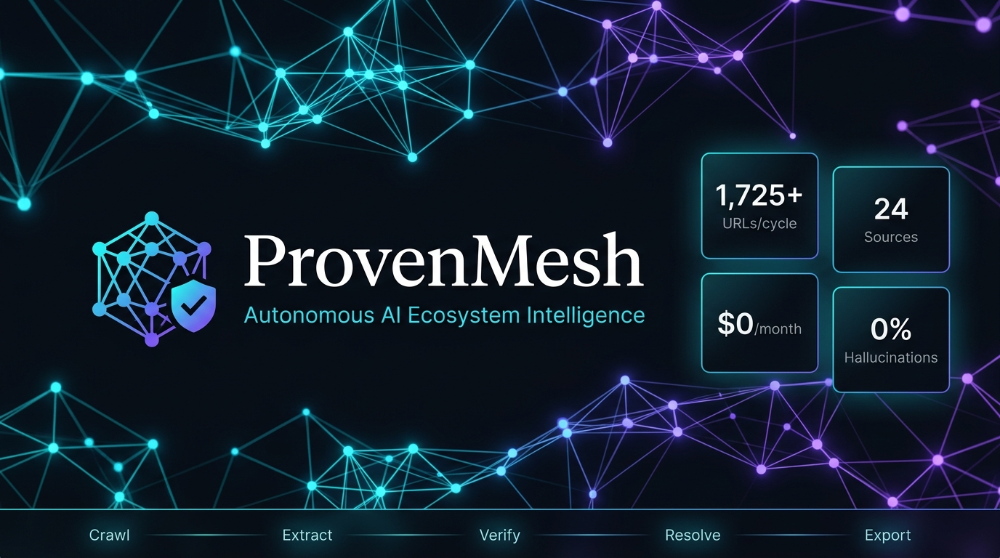
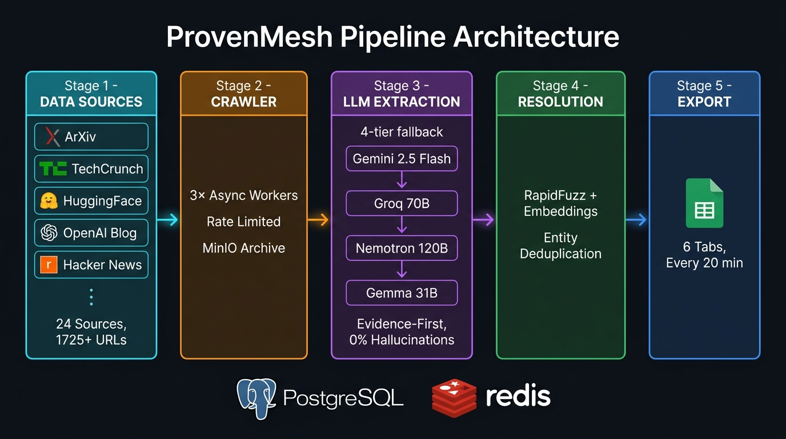
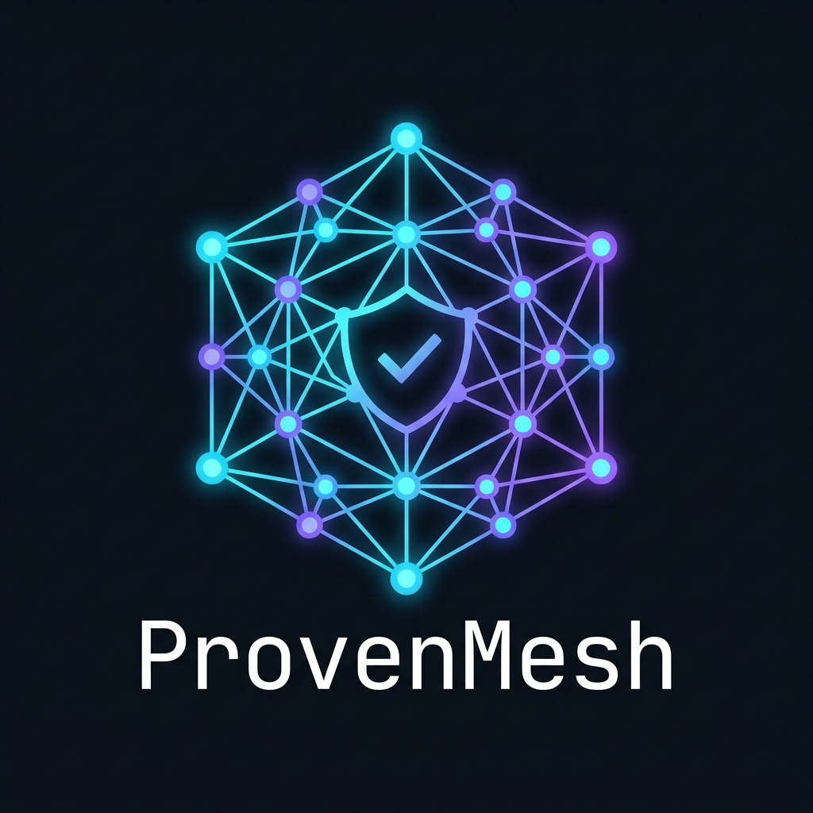

<div align="center">

</div>

---

## What is ProvenMesh?

ProvenMesh is an **always-on AI research assistant** that automatically monitors 24+ news sources, extracts information about AI startups, products, research papers, jobs, and news — then exports everything to a live Google Sheet, updated every 20 minutes.

Think of it as your personal Bloomberg Terminal for the AI world — **completely free**.

---

## Why does it exist?

Every day in the AI industry:
- **500+ research papers** get published on ArXiv
- **Hundreds of startups** announce funding or launch products
- **Thousands of job openings** appear across AI companies

No single person can read all of that. ProvenMesh reads it all for you and puts it in one organized spreadsheet.

---

## Live Dashboard

**[📊 Open Google Sheet →](https://docs.google.com/spreadsheets/d/130p3Bo5gZRBHWt9tK8J8BqVP5YY2ckaoCWW1UeC7vEc)**

| Tab | What it tracks |
|-----|---------------|
| 🚀 Startups | AI companies — name, funding, founders, location, investors |
| 🛠️ Products | AI tools — pricing, features, GitHub links |
| 📄 Papers | Research papers — abstract, authors, ArXiv ID |
| 💼 Jobs | AI job openings — salary, skills, remote policy |
| 📰 News | AI news articles — headline, summary, source link |
| 🔗 Entity Log | How the system matched & deduplicated entities |

*Auto-refreshes every 20 minutes while the pipeline is running.*

---

## How it works



In plain English:
1. **Crawl** — fetches articles from 24 sources simultaneously (ArXiv, TechCrunch, HuggingFace blog, OpenAI/Anthropic/DeepMind blogs, Hacker News, Wired, MIT Tech Review and more)
2. **Extract** — an AI model reads each article and pulls out structured data (name, funding amount, description, etc.)
3. **Verify** — every extracted fact must be backed by a direct quote from the source. No quotes = rejected.
4. **Resolve** — if "OpenAI" and "openai.com" appear in different articles, they get merged into one record
5. **Export** — writes everything to the Google Sheet every 20 minutes

---

## Zero hallucinations guarantee

Every field the AI extracts must include the exact sentence from the source article that proves it:

```json
{
  "fundingTotal": {
    "value": "$7.3B",
    "evidence": "...raised $7.3 billion in total funding as of 2024..."
  }
}
```

If no evidence is found → the field is left blank. **The AI cannot make things up.**

---

## What makes it special

| Feature | ProvenMesh | Manual research | Crunchbase Pro |
|---------|:----------:|:---------------:|:--------------:|
| Cost | **Free** | Free (but slow) | $500/month |
| Updated | **Every 20 min** | Whenever you do it | Days/weeks |
| Hallucinations | **0% (grounded)** | Human errors | Human errors |
| Sources | **24+ live feeds** | Whatever you find | Curated DB |
| Historical data | **30 days backfill** | You'd have to do it | Limited |

---

## Tech Stack

| Component | Technology |
|-----------|-----------|
| Language | Python 3.13 with async/await |
| AI Models | Gemini 2.5 Flash → Groq Llama 70B → Nemotron 120B → Gemma 31B (free fallback chain) |
| Queue | Redis Streams |
| Database | PostgreSQL 16 with vector search |
| Storage | MinIO (S3-compatible) for raw HTML archive |
| Entity matching | RapidFuzz + sentence embeddings |
| Export | Google Sheets API v4 |
| Infrastructure | Docker Compose |

---

## Quick Start

### Requirements
- [Docker Desktop](https://www.docker.com/products/docker-desktop/) — runs the database
- Python 3.11 or newer
- Free API keys (takes 5 minutes, see below)

### Setup

```bash
git clone https://github.com/Surajsharma0804/provenmesh.git
cd provenmesh
cp .env.example .env
# Edit .env and add your API keys
docker compose up -d
pip install -e ".[dev]"
alembic upgrade head
python scripts/seed_entities.py
```

### Run

**Windows:** double-click `start.bat`

**Mac/Linux:**
```bash
python -m provenmesh.main run --crawl-workers 3 --extract-workers 2 --resolve-workers 2 --auto-export --export-interval 20
```

### Force export to sheet anytime
```bash
python -m provenmesh.main export
```

---

## Free API Keys (5 minutes)

| Service | Model used | Free limit | Link |
|---------|-----------|-----------|------|
| Google AI Studio | Gemini 2.5 Flash | 15 requests/min | [Get key →](https://aistudio.google.com/app/apikey) |
| Groq | Llama 3.3 70B | 14,400 requests/day | [Get key →](https://console.groq.com/keys) |
| OpenRouter | Nemotron 120B + Gemma 31B | Unlimited free | [Get key →](https://openrouter.ai/keys) |

---

## After turning your PC back on

```bash
# 1. Start Docker Desktop (if not auto-started)
# 2. Double-click start.bat
```

Your data is safe — PostgreSQL stores everything in Docker volumes that persist across restarts.

---

## Project structure

```
provenmesh/
├── src/provenmesh/
│   ├── crawler/         # Fetches URLs from all 24 sources
│   ├── extraction/      # AI extraction with 4-provider fallback
│   ├── grounding/       # Evidence verification (anti-hallucination)
│   ├── resolver/        # Entity deduplication
│   ├── export/          # Google Sheets export
│   └── graph/           # Database layer (PostgreSQL)
├── assets/              # Logo and architecture diagrams
├── start.bat            # Windows one-click launcher
├── docker-compose.yml   # Database infrastructure
└── .env.example         # Configuration template
```

---

## License

MIT — free to use, fork, and build on.

---

<div align="center">

<br/>
<em>Built with Python 3.13 · Powered by free AI APIs · $0/month</em>
<br/><br/>
If this project was useful to you, please ⭐ star it on GitHub!
</div>
